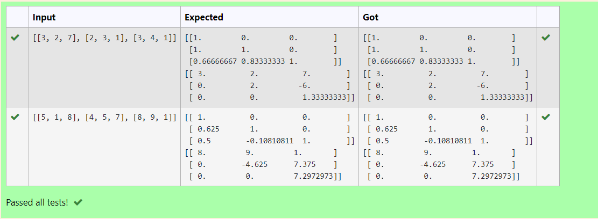
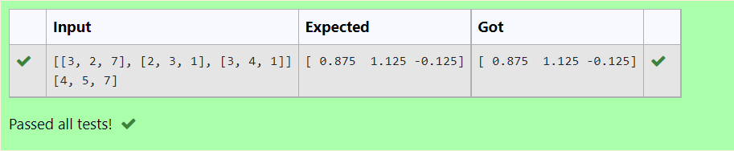

# LU Decomposition without zero on the diagonal


# LU Decomposition to find L and U matrix.
## AIM:
To write a program to find L and U matrix using LU decomposition.

## Equipments Required:
1. Hardware – PCs
2. Anaconda – Python 3.7 Installation / Moodle-Code Runner

## Algorithm
1. Import a python library named numpy and use np as it's shortened form.
2. Import lu from scipy.linalg.
3. Assign variable A to get the input from user.
4. Assign variables P , L, U which denotes pivot matrix, L matrix and U matrix respectively to lu of A .
5. Print L matrix.
6. Print U matrix.

## Program:
```
/*Program to find L and U matrix using LU decomposition.
Developed by: Sowmiya N
RegisterNumber: 21500134
*/

# To print L and U matrix
import numpy as np
from scipy.linalg import lu
A=np.array(eval(input()))
P,L,U=lu(A)
print(L)
print(U)
```

## Output:



## Result:
Thus the program to find the LU Decomposition of a matrix is written and verified using python programming.


# Use LU Decomposition to solve a matrix.
## AIM:
To write a program to slove a matrix using LU decomposition.

## Equipments Required:
1. Hardware – PCs
2. Anaconda – Python 3.7 Installation / Moodle-Code Runner

## Algorithm
1. Import a python library named numpy and use np as it's shortened form.
2. Import lu_factor and lu_slove from scipy.linalg.
3. Assign variable A and B to get the input from user.A  matrix will be the coefficient matrix and B matrix will be the constant matrix.
4. Assign lu matrix and pivot matrix to lu_factor of A matrix.
5. Assign varaible x is equal to lu_slove of (lu,pivot) and B matrix. 
6. Print x.

## Program:
```
'''Program to solve a matrix using LU decomposition.
Developed by: Sowmiya N
RegisterNumber: 21500134
'''

# To print X matrix (solution to the equations)
import numpy as np
from scipy.linalg import lu_factor, lu_solve
A=np.array(eval(input()))
B=np.array(eval(input()))
lu,pivot=lu_factor(A)
x=lu_solve((lu,pivot),B)
print(x)
```

## Output:



## Result:
Thus the program to slove a matrix using LU decomposition is written and verified using python programming.

